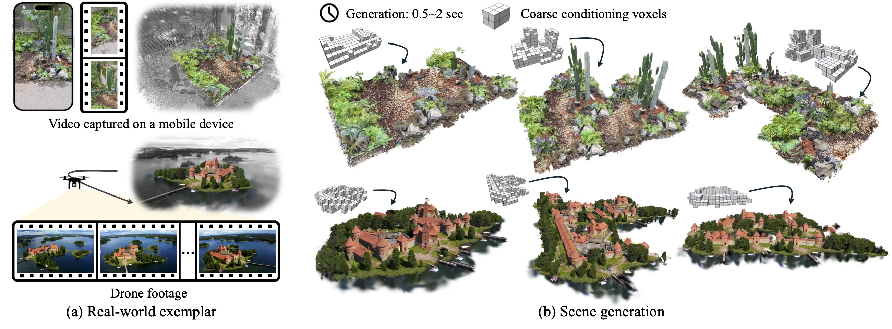

# ExCellGen: Fast, Controllable, Photorealistic 3D Scene Generation from a Single Real-World Exemplar

Official code release for the paper:  
**ExCellGen: Fast, Controllable, Photorealistic 3D Scene Generation from a Single Real-World Exemplar**  
CVM 2026  
[Clément Jambon](https://clementjambon.github.io/), [Changwoon Choi](https://www.changwoon.info/), [Dongsu Zhang](https://dszhang.me/about), [Olga Sorkine-Hornung](https://igl.ethz.ch/people/sorkine/), [Young Min Kim](https://3d.snu.ac.kr/members)

[[Paper]](https://arxiv.org/abs/2412.16253) · [[Supplemental Document]](assets/supplemental.pdf) · [Supplemental Video (Soon)]

## Requirements

* **Ubuntu** 20.04 or higher
* **NVIDIA GPU** [compatible](https://docs.nvidia.com/deploy/cuda-compatibility/) with CUDA 11.8
* **Miniconda** or Anaconda to manage Python virtual environments
* A version of **GCC** higher than 8

## Instructions

For clarity, instructions are provided in separate files:
* [Installation](docs/installation.md)
* [Gaussians, Post-processing and Training of GCAs](docs/training.md)
* [Generation](docs/generation.md)
* [Shortcuts Sheet](docs/shortcuts.md)
* [Codebase Overview](docs/overview.md)
* [Reproducing Benchmarks](docs/benchmarks.md)