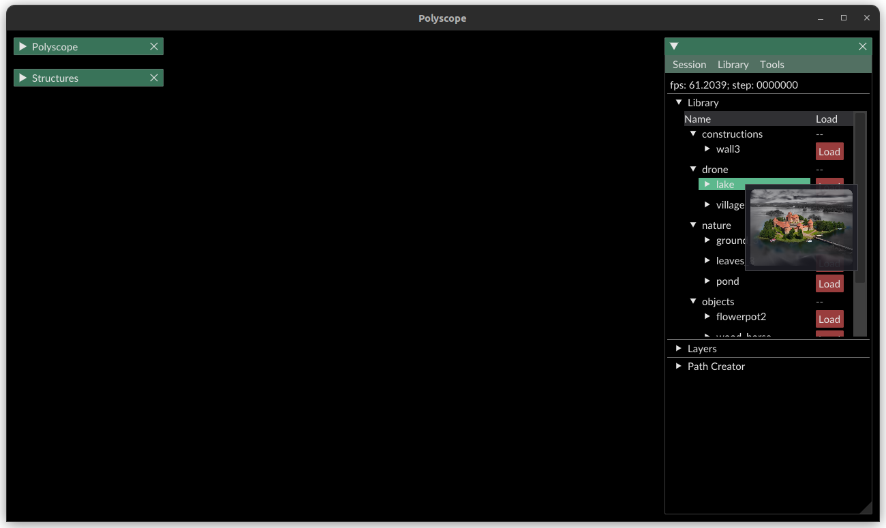
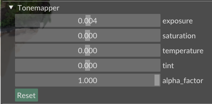

# Generation

**NOTE:** If at any stage, shortcuts do not work, please go to `Tools > Unlock keys`.

## Library

If you want to get started with a set of primitives, we provide a set of curated "demo primitives" showcased in our supplemental video at this [link](https://drive.google.com/file/d/1D4b4myC0jsA6XMeHmi-TVKu-ZpVIaKm2/view?usp=sharing). Simply unzip the archive and set `PRIMITIVES_ROOT` to the location where you extracted the archive or copy it in your default `primitives` folder  (within your `sprim` folder).

The library displays each primitive according to your `PRIMITIVES_ROOT` folder hierarchy. 

For each primitive, you can 
* either visualize the reconstructed 3D Gaussians of the corresponding initial scene. For this, click on "Load".
* or, import a pre-selected and pre-trained primitive (cf. [Previous instructions](training.md)) by opening the nested drawer and selecting a primitive with "Load". Note that if you haven't trained the corresponding GCA, the "Load" button will appear in Red and you will only be able to visualize the corresponding set of 3D Gaussians.

*Reminder:* for each primitive, you can add a thumbnail image at the root of the corresponding folder under the name `preview.png`.

## Layers & Manipulation

Each time you load or generate content, a *layer* is created. Intuitively, this is very similar to Photoshop and many other content creation software.
* You can rename layers by double-clicking on them and entering a name.
* Delete them by clicking on the cross button.
* Hide them by ticking the "Show" textbox
* Duplicate layers by using `Ctrl + D`
* Merge layers by going to `Tools > Merge Layer`
* If you press `1`, the camera will focus on the corresponding set of 3D Gaussians.

Each layer can easily be manipulated:
* keep `m` pressed to translate and rotate the layer
* keep `n` pressed to scale the layer

## Creating an exemplar brush

In order to author content, the default scenario is to use an "exemplar brush". You can create one by going to `Brush Creator`.

Once there, you should see a bounding box appear. Press `Select` to initialize the selection and an initial point-cloud should appear. Similar to primitive preparation (with "Latent Exporter"), you can refine your selection until satisfied. Don't forget to apply your selection before saving it. To save it, press `Save` and enter your preferred name. By default, exemplar brushes will be saved in `[THIS_PRIMITIVE_FOLDER]/exemplar_brushes/[NAME]` where `[NAME]` should end with `.npz`!

Feel free to create as many exemplar brushes as you wish. Try to take relevant subsets of the shape. See the example of the pond and its waterfall in the manuscript.

## Using a Specialized Primitive 

To use a specialized primitive, open the `Brush Painter` tab. At the top of the drawer, you should see a list of "exemplar brushes". 
Select an exemplar brush and use it to brush content. To do so displace the set of voxels using the gizmo and press `a` every time you want to apply the brush.
At any stage, you can edit manually voxels by maintaining `Alt` (similar to the `PcSelector`) and clicking on the corresponding voxels. Switch between edit modes "Add" (Green) / "Remove" (Red) by pressing `s`.

If you want to use a mesh instead, simply drag and drop the mesh inside the viewer, use the gizmo and press `a` every time you want to apply the mesh. Note that, we **only** support `.obj` meshes.

After brushing and editing, you can always save/load your "Paintings" by clicking on `Save`/`Load`. By default, this will be saved in `[THIS_PRIMITIVE_FOLDER]/brush_painting/[NAME]` where `[NAME]` should end with `.painting`. Note that you can also save the set of edited voxels as another exemplar brush by pressing `Save(brush)`.

You are now ready to generate with the corresponding primitive: simply press `g` (or the `Grow` button). Feel free to draw multiple samples until you are satisfied with the result!

## Exporting/Loading sessions

You can export and load sessions using `Session > Load session/Save session`. Both operations may take a while as we save uncompressed Gaussians in each session archive. 
Note that during editing, you can load as many sessions as you want. The layers stored in each file will simply be appended to your current session.

## Tone-mapping

You can tone-map the set of Gaussians of a given layer by clicking on the corresponding layer and opening the "Tonemapper" drawer.

 

## Screenshots and recording

* Use `Shot` (shortcut `t`) to capture a screenshot of rendered **Gaussians only**.
* Use `Shot (PS)` (shortcut `u`) to capture a screenshot of rendered Gaussians and Polyscope's additional content (except UI).
* Use `Record` to record a video of **Gaussians only**.

By default, screenshots will be written in `screenshots` and recordings in `recordings`.

## Rendering with camera paths

You can render scenes at the resolution and following the aspect ratio of the viewer by using the "Path Creator".
Simply add/remove as many keyframes as you want and edit the corresponding times in the table below.
Then, press `Render` to render the path. Similar to screen recording, it will be saved in `recordings`. 
Note that only 3D Gaussians will be recorded, not Polyscope!
You can save/load paths using the dedicated buttons.