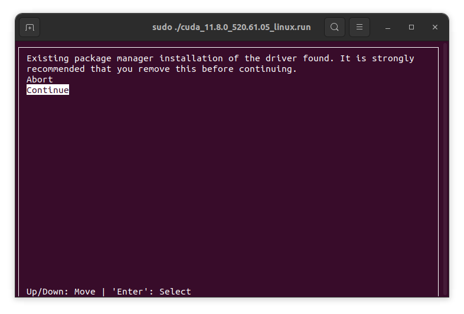
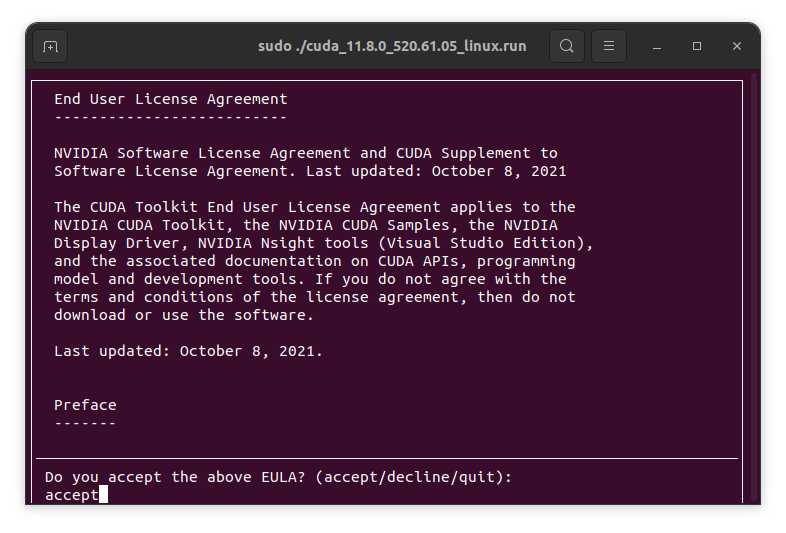
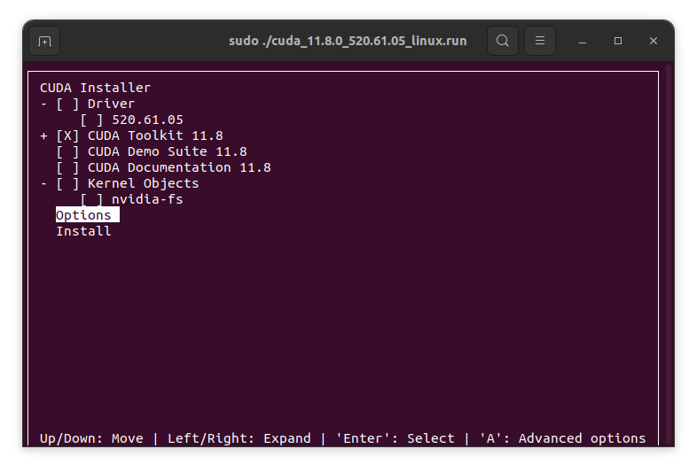
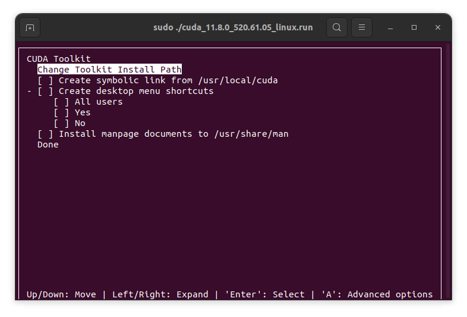
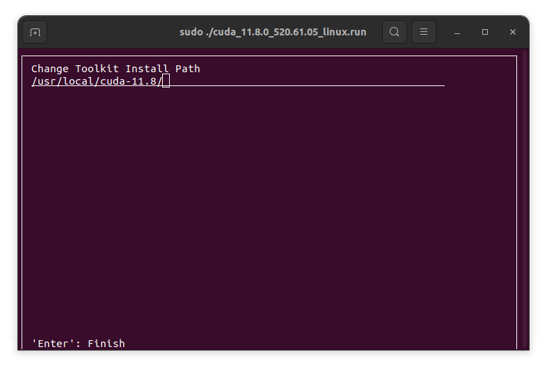
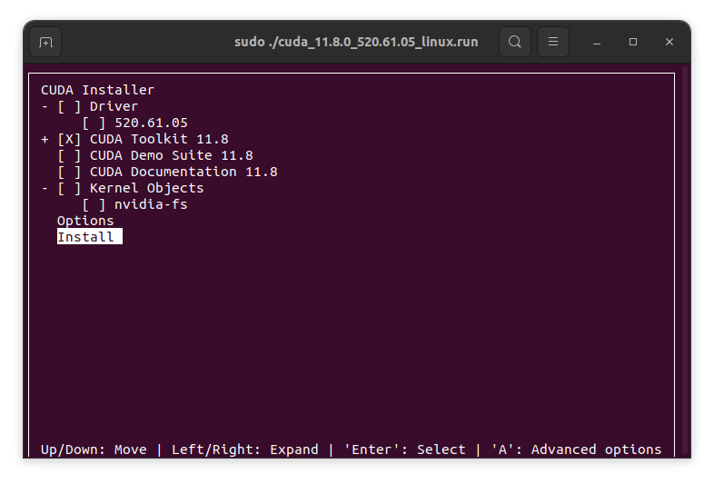

# Installation

The current pipeline relies on a lot of components. Please make sure to follow these steps sequentially and carefully.

## Everything starts with CUDA

Every project starts with a small fight against CUDA. As of today, I can guarantee things work with **CUDA 11.8**. I insist, if you try anything else, I'm not sure 100% things will work properly. 

If you don't have this version already, simply download the `.run` file at [this address](https://developer.nvidia.com/cuda-11-8-0-download-archive) and follow the procedure below to install it without interfering with your existing setup.

```sh
sudo ./[YOUR_INSTALL_BINARIES].run
```

The command above should take some time due to the extraction.

Press `Continue`



Enter `accept`



Untick everything except the toolkit and go to `Options`. Make sure you have some drivers already though! Otherwise, install them 😀



Untick everything



Set the installation path to something like that



Return to the initial menu and press `Install`




## Setting up your environment 

Start by cloning this repository and its submodules
```sh
git clone --recursive git@github.com:clementjambon/excellgen.git
cd sprim
# This shouldn't be necessary with `--recursive` above.
git submodule update --init --recursive
```

Then, create a conda environment following
```sh
conda create -n sprim python=3.11
pip uninstall setuptools
pip install setuptools==64 # This seems to be required to build MinkowskiEngine
```

Once you're done, create an `activate.sh` shell script inside the cloned repository to automatically setup your conda environment, CUDA/build environment and other environment variables that will be necessary very soon.
```sh
# Uncomment if you use a laptop with an intel chipset.
# Without this, Polyscope may end up reading the wrong device.
# export __NV_PRIME_RENDER_OFFLOAD=1 
# export __GLX_VENDOR_LIBRARY_NAME=nvidia

conda activate sprim

export PATH="/usr/local/cuda-11.8/bin:$PATH"
export LD_LIBRARY_PATH="/usr/local/cuda-11.8/lib64:$LD_LIBRARY_PATH"
export CUDA_HOME=/usr/local/cuda-11.8

export DATA_ROOT=[YOUR NERF DATASET FOLDER]
# If cloned properly, it should be located in SPRIM_FOLDER/deps/fast-gca
export GCA_ROOT=[YOUR FAST_GCA FOLDER]
# Optional
# If you use another primitive root folder
# export PRIMITIVES_ROOT=[YOUR PRIMITIVES ROOT]
# The path of preprocessed primitives for benchmarks
# export EXP_PRIMITIVES_ROOT=[YOUR EXP_PRIMITIVES ROOT]
```

**Make sure to replace CUDA path with yours!**

You're now ready to start the package adventure but before that, don't forget to activate your "augmented" environment with
```sh
source activate.sh
```

## Installing custom dependencies


Let's start with Pytorch! Install Pytorch 2.1.2 for CUDA 11.8 with
```sh
pip install torch==2.1.2 torchvision==0.16.2 torchaudio==2.1.2 --index-url https://download.pytorch.org/whl/cu118
```

Don't install newer versions as there is a "known" bug with Minkowski Engine.
Note that we **do** need `torchaudio` for screen recording!

### (optional) COLMAP

If you want to process your own datasets, you'll need COLMAP. I installed it manually but apparently, you can do it with
```sh
conda install -c conda-forge colmap
```

If it is already installed on your machine, things should be fine.

In both cases, you need `ffmpeg`:
```sh
sudo apt install ffmpeg
```

### Minkowski Engine 

We use a forked version of [Minkowski Engine](https://github.com/NVIDIA/MinkowskiEngine) to fix a few compilation issues with more recent versions of CUDA. To install it, follow carefully these steps (ideally in another folder than the `sprim` one):
```sh
# Install system requirements
sudo apt install build-essential python3-dev libopenblas-dev

# For cluster installation, replace with
# conda install openblas-devel -c anaconda

git clone https://github.com/clementjambon/MinkowskiEngine.git deps/MinkowskiEngine
cd deps/MinkowskiEngine
export MAX_JOBS=4 # that's safer
# For cluster installation: export CXX=g++-8 
python setup.py install
cd ../..
```

A lot of warnings should show up. As long as it doesn't crash, it's fine!

### Polyscope

Polyscope will be installed automatically with `sprim`, but you might face issues with the standard C++ library if you compile with your default compiler so make sure to install the libraries below:
```sh
conda install -c conda-forge libstdcxx-ng
sudo apt install xorg-dev libglu1-mesa-dev freeglut3-dev mesa-common-dev
```

### Torch-scatter

Finally, torch-scatter:
```sh
pip install --no-index torch-scatter -f https://pytorch-geometric.com/whl/torch-2.1.2+cu118.html
```

## Installing our libraries


### sprim 

We're almost there! Install this library with
```sh
pip install -r requirements.txt
pip install -e .
```

**Don't forget to add your `DATA_ROOT` in your `activate.sh` and to uncomment the corresponding line!**

Note that `DATA_ROOT` should be the root folder containing all the NeRF datasets following directly the naming convention of our "Specialized Primitives Dataset" i.e., `[category]/[name]`. In other words, don't take the folder including `raw` and `nerf` but directly the `nerf` one.

## Troubleshooting 

If you're missing packages along the way, simply install them and hope it won't go 💥